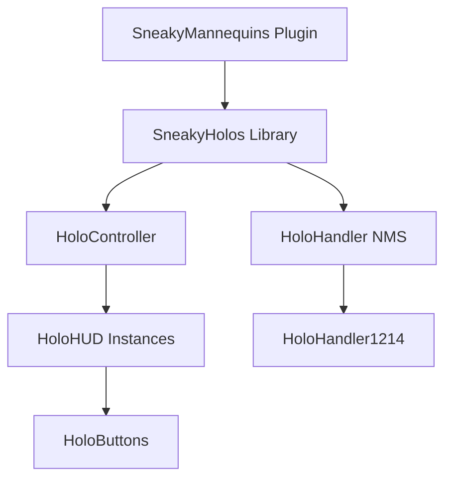

# HoloUX Workspace

A unified workspace for developing high-performance holographic user interfaces for Minecraft (Paper). This repository serves as a meta-project container using Git submodules to manage its core components.

## Repositories

This workspace consists of two primary repositories:

- **[SneakyHolos](./SneakyHolos)**: A standalone library for high-performance NMS holographic UI management (TextDisplays, ItemDisplays, and virtual Interaction entities).
- **[SneakyMannequins](./SneakyMannequins)**: A feature-rich plugin that utilizes SneakyHolos to render interactive 3D skin previews and customization HUDs.

## Development Setup

### 1. Webserver for Online Features
The `SneakyMannequins` plugin requires a webserver to serve dynamic skin assets. A dev webserver is provided via Docker.

```bash
cd SneakyMannequins
docker-compose up -d
```
The webserver will be available at `http://localhost:8080`.

### 2. External Exposure (Optional)
To test online features from outside your local network (e.g., such as for feeding the created images to the MineSkin api), you can use Pinggy to create a public tunnel:

```bash
ssh -p 443 -R0:localhost:8080 a.pinggy.io
```
Note the `.pinggy.link` URL provided in the terminal.

### 3. Plugin Configuration
Update your `run/plugins/SneakyMannequins/config.yml` to point to your dev webserver:

```yaml
images:
  storage-path: "../web/images/"
  url-prefix: "http://localhost:8080/images/" # Change this to your Pinggy URL for external testing
```

## Architecture



## Contributing

For component-specific development instructions, refer to the README files within each submodule:
- [SneakyHolos README](./SneakyHolos/README.md)
- [SneakyMannequins README](./SneakyMannequins/README.md)
