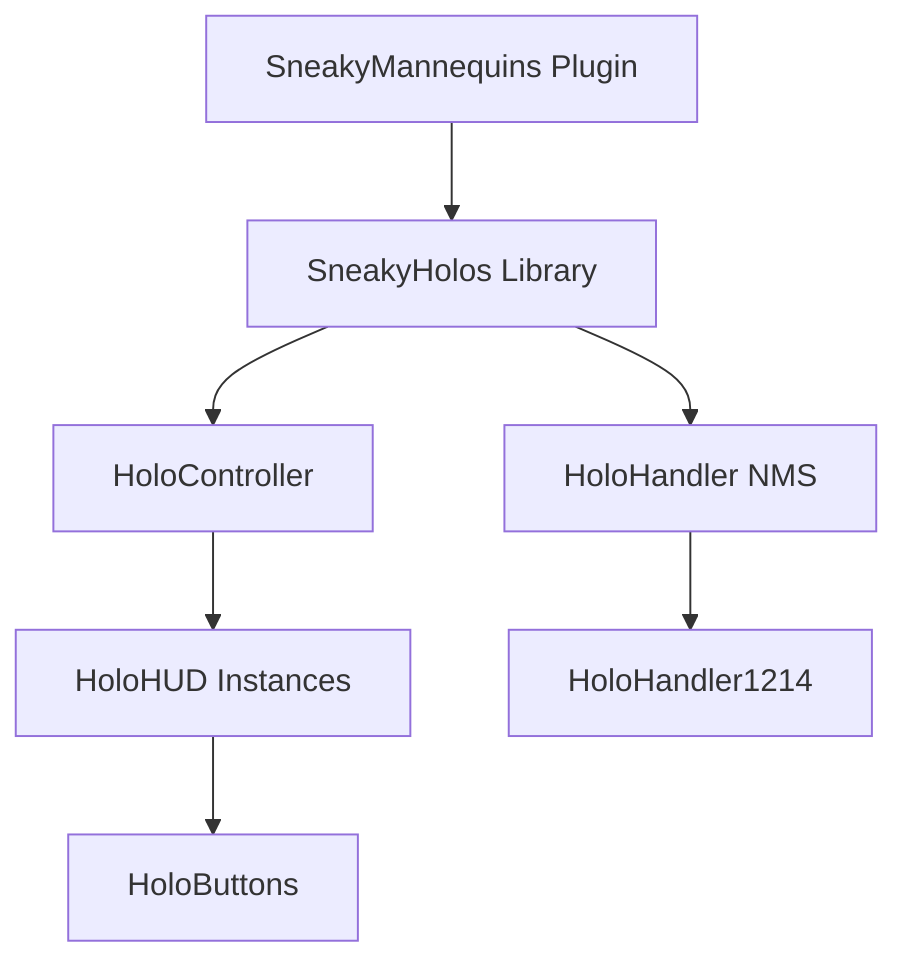

# HoloUX Workspace

A unified workspace for developing high-performance holographic user interfaces for Minecraft (Paper). This repository serves as a meta-project container using Git submodules to manage its core components.

## Repositories

This workspace consists of two primary repositories:

- **[SneakyHolos](./SneakyHolos)**: A standalone library for high-performance NMS holographic UI management (TextDisplays, ItemDisplays, and virtual Interaction entities).
- **[SneakyMannequins](./SneakyMannequins)**: A feature-rich plugin that utilizes SneakyHolos to render interactive 3D skin previews and customization HUDs.

## Quick Start

### 1. Clone with Submodules
```bash
git clone --recursive <repository-url>
cd HoloUX-Workspace
```

### 2. Build Everything
This workspace provides a unified Gradle harness to build and test all components at once.
```bash
./gradlew build
```

### 3. Run Test Server
Launch a Paper 1.21.4 server with both the library and plugin injected.
```bash
./gradlew runServer
```

## Workspace Structure

The root directory acts as a "testing harness" and development coordinator:
- **`SneakyHolos/`**: The library source (Git Submodule).
- **`SneakyMannequins/`**: The plugin source (Git Submodule).
- **`run/`**: Shared server environment used by both modules for testing.
- **`build.gradle.kts`**: Unified build logic coordinating the child modules.

## Architecture



## Contributing

For component-specific development instructions, refer to the README files within each submodule:
- [SneakyHolos README](./SneakyHolos/README.md)
- [SneakyMannequins README](./SneakyMannequins/README.md)
